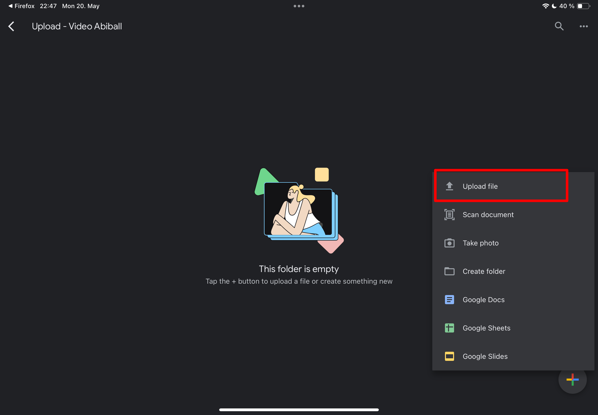
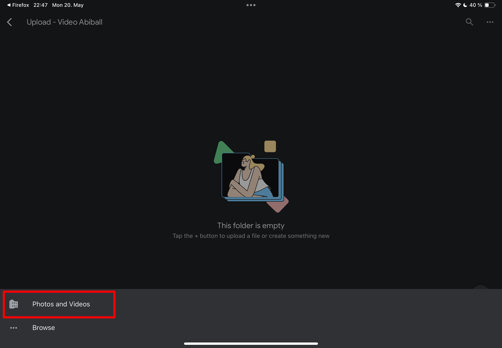

# Upload von Dateien auf Google Drive

> [!IMPORTANT]
> Für den Dateiupload wird ein Google Konto benötigt.
> Solltest du noch kein Google Konto besitzen, kannst du [hier](https://accounts.google.com/signup) ein kostenloses Google Konto erstellen.

## Liste der Uploadlinks für den Abiball

- [Uploadlink: Video für den Abiball](https://drive.google.com/drive/folders/1gnDCgtXD65a4o8WZW17d9JhMavnQM6Ab?usp=drive_link)

## Upload vom Smartphone

Es wird empfohlen, die Google Drive App ([Download Android](https://play.google.com/store/apps/details?id=com.google.android.apps.docs&hl=en_AU) | [Download iOS & iPadOS](https://apps.apple.com/de/app/google-drive-dateispeicher/id507874739)) zu verwenden, allerdings ist ein Upload auch über die Website von Google Drive möglich.

### Android (Google Drive App)

1. Klicke nach der Installation der [Google Drive App](https://play.google.com/store/apps/details?id=com.google.android.apps.docs&hl=en_AU) auf den geünschten Uploadlink (siehe oben).
2. Nun öffnet sich die Google Drive App in dem gewünschten Ordner.
3. Durch Klicken auf die untere rechte Schaltfläche "+ New" (siehe Bildschirmfoto) öffnet sich ein Menü.
   
4. In dem Menü muss jetzt nur noch auf "Upload" gedrückt werden.
   
5. Es öffnet sich nun ein Fenster, in dem eine oder mehrere Dateien (mehrere Dateien durch langes drücken auf die erste Datei) ausgewählt werden können.
6. Nach der Auswahl der mehrerer Dateien, muss am obrern rechten Rand der Dateiauswahl noch der "select"-button gedrückt werden, um den Upload zu bestätigen.

### iOS & iPadOS (Google Drive App)

1. Klicke nach der Installation der [Google Drive App](https://apps.apple.com/de/app/google-drive-dateispeicher/id507874739) auf den geünschten Uploadlink (siehe oben).
2. Nun öffnet sich die Google Drive App in dem gewünschten Ordner.
3. Durch Klicken auf die untere rechte Schaltfläche "+" (siehe Bildschirmfoto) öffnet sich ein Menü.
   
4. In dem Menü muss jetzt auf "Upload file" gedrückt werden.
   
5. Es öffnet sich nun ein weiteres Menü. Sollten sich die Dateien in deiner Galerie (z.B. Fotos oder Videos) befinden, so wähle "Photos and Videos" aus. Sollten sich die Dateien auf anderen Verzeichnissen befinden, wähle "Browse" aus.
   
6. Es öffnet sich nun ein Fenster, in dem eine oder mehrere Fotos oder Videos / Dateien ausgewählt werden können.
7. Nach der Auswahl der mehrerer Dateien, muss am obrern rechten Rand der Dateiauswahl noch der "Done"-button gedrückt werden, um den Upload zu bestätigen.

## Upload vom PC oder Mac

1. Klicke auf den Link zum Upload
2. Es öffnet sich nun die Website von Google Drive
3. Mit einem Rechtsklick auf eine leere Fläche öffnet sich ein Popup-Menü.
   
4. Möchtest du eine oder mehrere Dateien hochladen, wähle "File upload". Möchtest du einen ganzen Ordner hochladen, wähle "Folder Upload"
5. Es öffnet sich im Anschluss ein Fenster, mit dem du Dateien auswählen kannst.
6. Nach der Bestätigung der Dateiauswahl werden die Dateien hochgeladen.
7. Lasse das Fenster offen, bis der Upload (siege popup unten rechts) abgeschlossen ist.
